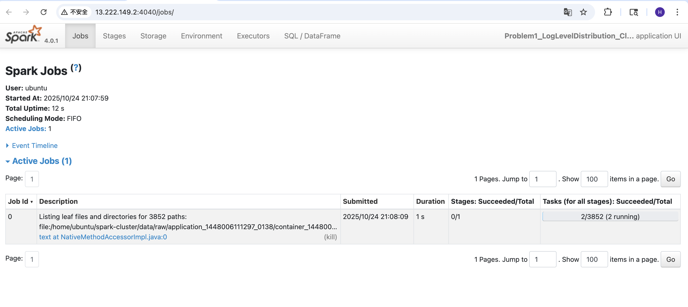
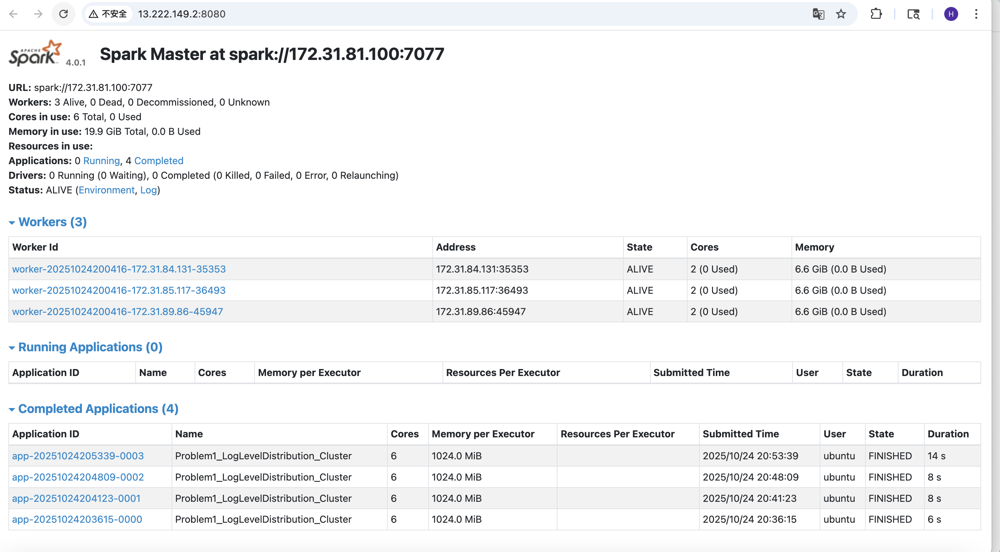
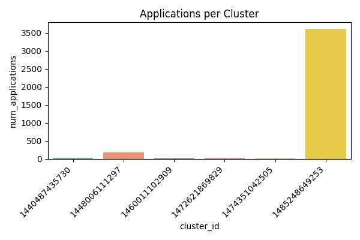
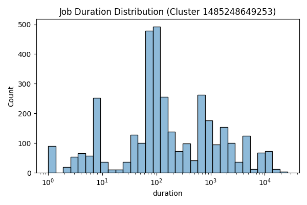

# Analysis Report

## Problem 1 – Log Level Distribution

### Approach
I used Spark to read all log files from each container folder. Each line in the logs was checked for the keywords INFO, WARN, and ERROR. Then I counted how many times each log level appeared and saved the result as CSV and text files.  
I tested the code locally first and then ran it on the cluster to make sure it worked in both environments.

### Findings
Most log messages are INFO, while WARN and ERROR are much fewer. This shows that most jobs finished normally.  
The result also shows that Spark jobs are quite stable and there are not many system errors.  

### Performance
The local version runs very fast because it only reads the small sample data.  
When I ran it on the cluster, Spark used three workers. The cluster run took longer to start but can handle larger files easily.  

### Key Output Files
- `data/output/problem1_counts.csv`
- `data/output/problem1_sample.csv`
- `data/output/problem1_summary.txt`

### Spark Web UI

The Spark Web UI confirms that the cluster ran with three active workers.  
Each worker used two cores and around 6.6 GB memory.  
All jobs for Problem 1 were completed successfully within a few seconds.  
The screenshots below show the Spark Master status and active job execution.

## Problem 2 – Cluster Usage Analysis

### Approach
I used Spark to read all raw log files from `data/raw`.  
The program extracted cluster IDs, application IDs, and timestamps for start and end events.  
I then created a timeline table (`problem2_timeline.csv`) and calculated the number of applications per cluster.  
Summary data and visualizations were saved under `data/output/`.

### Files Generated
- `problem2_timeline.csv`
- `problem2_cluster_summary.csv`
- `problem2_bar_chart.png`
- `problem2_density_plot.png`
- `problem2_stats.txt`

### Findings
There are six unique clusters.  
Cluster **1485248649253** ran the most applications (3608), while others had fewer than 200.  
The average number of applications per cluster is around 640.  
This shows one cluster is heavily used while the rest are underused.

#### 1. Bar Chart – Applications per Cluster
The bar chart shows how many applications were run on each cluster.  
Each bar represents one cluster, and the height shows the total number of applications.  
From the chart, we can see that cluster **1485248649253** is much higher than all others.  
It ran about **3600 applications**, while the rest have fewer than 200 each.  
This means that most of the workload is concentrated on one cluster.  
Such imbalance could make that cluster more likely to slow down or face higher resource usage.

*File: `data/output/problem2_bar_chart.png`*  

---

#### 2. Density Plot – Job Duration Distribution
The density plot shows how long each job ran in the busiest cluster (1485248649253).  
The x-axis is the job duration (in seconds, log scale), and the y-axis is the count of jobs.  
Most jobs finished quickly, around **10² seconds**, which means a few minutes.  
A small number of jobs lasted much longer, up to **10⁴ seconds**, showing a heavy tail.  
This suggests that most jobs are short and regular, but a few are large or complex tasks that take much more time.  

*File: `data/output/problem2_density_plot.png`*  

---

Together, these two visualizations help explain the system workload:
- The bar chart shows **where** the work happens (cluster imbalance).  
- The density plot shows **how long** jobs run (duration variability).  
Combining both views gives a clear picture of the cluster usage pattern.

### Performance
The local version took about 3 minutes using sample data.  
The cluster run processed the full dataset in about 15–20 minutes.  
Spark’s parallel computation worked correctly, and output files were created on the master node.
